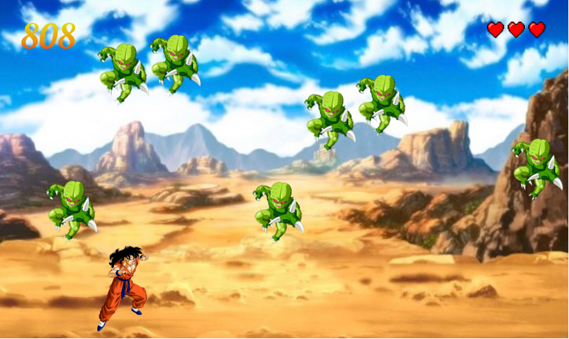

# Yamcha's Doom

Relive the meme that is Yamcha's demise

### Movement Controls :

- up: W
- left: A
- down: S
- right: D

[Click Here to Play](https://yamchas-doom.netlify.app/)

## Requirements

> Using a pre-made engine, customize and add functionality to it.

## Tech

- Vanilla JavaScript
- OOP

## Features added

- Collision detection
- Ability to go up or down
- Lives
- Added higher score increment for higher positioning
- Customized to DragonBall Z theme
- Edited size of playing screen
- Adjusted speed and number of enemies accordingly
- Added defeated Yamcha

## Provided Game Appearance

